# PSI5120 — Trabalho Avaliativo I
# Roteiro de Implantação e Testes — Autoescalamento Horizontal de Pods (HPA)

**PSI512 — Tópicos em Computação em Nuvem** 

**Trabalho Avaliativo 1** 

**Aluno:** Matheus Latorre Cavini — nº USP 12550494 

**Data:** 24/08/2026

**Link do Repositório**: [https://github.com/MatheusCavini/PSI5120-Trabalho-Avaliativo-I](https://github.com/MatheusCavini/PSI5120-Trabalho-Avaliativo-I)

---

## 1. Introdução e objetivos

Neste trabalho, foi implantado um servidor web simples em dois ambientes Kubernetes — um cluster local criado com Minikube e um cluster gerenciado na AWS EKS — para validar, nos dois, o funcionamento do Horizontal Pod Autoscaler (HPA). Este roteiro registra os comandos, as configurações e os testes de carga utilizados, desde a instalação do ambiente até a coleta das evidências.

Tanto o cluster local quanto o cluster em nuvem foram criados do zero para este trabalho, com nomes e namespaces próprios. As duas trilhas (local e EKS) usam a mesma aplicação e os mesmos manifestos, o que permitiu isolar o que de fato muda entre os dois ambientes: a instalação do Metrics Server, a forma de disponibilizar a imagem para o cluster, e a capacidade computacional disponível.

Os manifestos, o Dockerfile e o código da aplicação estão todos embutidos neste roteiro, nas seções correspondentes, exatamente como estão no código disponível via GitHub.

---

## 2. Aplicação de referência

Os dois materiais de referência citados no enunciado (documentação do Kubernetes e da AWS para HPA) usam o exemplo `php-apache`, uma imagem com um script que consome CPU de forma controlada, e é esse consumo controlado que dá ao HPA um sinal real para reagir. Em vez de usar essa imagem pronta, a aplicação Python utilizada na Aula 4 foi adaptada, mantendo a mesma base (biblioteca padrão do Python, contador persistido em disco, endpoints `/`, `/api/status`, `/health`), com a página inicial personalizada para este trabalho, e com o acréscimo de um endpoint `/work` que cumpre o mesmo papel do script PHP do exemplo oficial, de gerar carga de trabalho em CPU.

### 2.1 `app.py` (adaptado da Aula 4)

A mudança funcional em relação à versão da Aula 4 é o endpoint `/work` e a variável de ambiente `WORK_ITERATIONS`, que controla a intensidade do cálculo; a página HTML servida em `/` também foi personalizada. O restante do arquivo — leitura de mensagem, contador persistido, servidor HTTP com biblioteca padrão — é o mesmo.

```python
#!/usr/bin/env python3
"""Aplicação web do Trabalho Avaliativo 1 da PSI5120 - Matheus Cavini.

Adaptada a partir do app.py da Aula 4 (mesma base: apenas biblioteca padrão
Python, mesmo padrão de contador persistido e de endpoints), com página
personalizada para este trabalho e com o acréscimo do endpoint /work, que
substitui o papel do endpoint de teste do exemplo oficial php-apache
(citado nas referências do trabalho) por uma versão em Python puro.

Endpoints:
- /            página HTML
- /api/status  estado em JSON
- /health      resposta simples de saúde
- /work        consome CPU de forma controlada, usada para acionar o HPA

O contador é persistido no diretório definido por DATA_DIR, por padrão /data.
A mensagem é lida de PSI5120_MESSAGE ou, se MESSAGE_FILE estiver definido,
do arquivo indicado por MESSAGE_FILE.
A intensidade do endpoint /work é controlada por WORK_ITERATIONS.
"""

from http.server import BaseHTTPRequestHandler, ThreadingHTTPServer
from pathlib import Path
from datetime import datetime, timezone
import json
import math
import os
import socket
import sys
import time

APP_PORT = int(os.environ.get("APP_PORT", "8080"))
DATA_DIR = Path(os.environ.get("DATA_DIR", "/data"))
AUTOR = os.environ.get("PSI5120_AUTOR", "Matheus Cavini")
MESSAGE = os.environ.get("PSI5120_MESSAGE", f"Trabalho Avaliativo 1 - PSI5120 - {AUTOR}")
MESSAGE_FILE = os.environ.get("MESSAGE_FILE", "")
COUNTER_FILE = DATA_DIR / "counter.txt"

# Quantidade de iterações do laço de /work. Controla o tempo de CPU gasto
# por requisição: quanto maior, mais tempo cada chamada ocupa um núcleo de
# CPU. O valor padrão foi escolhido para gerar uma carga perceptível sem
# travar a resposta por muito tempo; pode ser recalibrado por ambiente
# através da variável de ambiente WORK_ITERATIONS, sem alterar o código.
WORK_ITERATIONS = int(os.environ.get("WORK_ITERATIONS", "2000000"))


def log(message: str) -> None:
    now = datetime.now(timezone.utc).isoformat()
    print(f"{now} {message}", flush=True)


def read_message() -> str:
    if MESSAGE_FILE:
        try:
            content = Path(MESSAGE_FILE).read_text(encoding="utf-8").strip()
            if content:
                return content
        except FileNotFoundError:
            return f"{MESSAGE} (arquivo de mensagem nao encontrado: {MESSAGE_FILE})"
        except OSError as exc:
            return f"{MESSAGE} (erro ao ler MESSAGE_FILE: {exc})"
    return MESSAGE


def increment_counter() -> int:
    DATA_DIR.mkdir(parents=True, exist_ok=True)
    try:
        current = int(COUNTER_FILE.read_text(encoding="utf-8").strip())
    except (FileNotFoundError, ValueError):
        current = 0
    current += 1
    COUNTER_FILE.write_text(str(current), encoding="utf-8")
    return current


def cpu_burn(iterations: int) -> float:
    """Executa um cálculo matemático repetitivo, sem efeito colateral,
    apenas para consumir CPU de forma controlada e mensurável pelo
    Metrics Server. É o equivalente, em Python puro, ao script PHP que
    calcula raízes quadradas em loop na imagem registry.k8s.io/hpa-example
    usada no walkthrough oficial do Kubernetes."""
    total = 0.0
    x = 0.0001
    for i in range(iterations):
        x = math.sqrt(x + i)
        total += x
    return total


class Handler(BaseHTTPRequestHandler):
    server_version = "PSI5120Trab1/1.0"

    def _send(self, status: int, body: bytes, content_type: str) -> None:
        self.send_response(status)
        self.send_header("Content-Type", content_type)
        self.send_header("Content-Length", str(len(body)))
        self.end_headers()
        self.wfile.write(body)

    def do_GET(self) -> None:  # noqa: N802 - required by BaseHTTPRequestHandler
        # /health e /work não incrementam o contador: /health porque é uma
        # verificação de infraestrutura, e /work porque é chamado em alta
        # frequência pelo gerador de carga e não deve competir por I/O de
        # disco com o cálculo de CPU que está sendo medido.
        if self.path == "/health":
            self._send(200, b"ok\n", "text/plain; charset=utf-8")
            return

        if self.path == "/work":
            start = time.monotonic()
            result = cpu_burn(WORK_ITERATIONS)
            elapsed_ms = (time.monotonic() - start) * 1000
            log(f"work path={self.path} client={self.client_address[0]} elapsed_ms={elapsed_ms:.2f}")
            body = f"work done result={result:.4f} elapsed_ms={elapsed_ms:.2f}\n".encode("utf-8")
            self._send(200, body, "text/plain; charset=utf-8")
            return

        counter = increment_counter()
        message = read_message()
        log(f"request path={self.path} client={self.client_address[0]} counter={counter}")

        if self.path == "/api/status":
            payload = {
                "service": "psi5120-trab1-webapp",
                "autor": AUTOR,
                "status": "ok",
                "message": message,
                "counter": counter,
                "hostname": socket.gethostname(),
                "data_dir": str(DATA_DIR),
                "message_file": MESSAGE_FILE or None,
                "work_iterations": WORK_ITERATIONS,
                "time_utc": datetime.now(timezone.utc).isoformat(),
            }
            self._send(200, json.dumps(payload, indent=2).encode("utf-8") + b"\n", "application/json; charset=utf-8")
            return

        if self.path == "/":
            html = f"""<!doctype html>
<html lang=\"pt-BR\"><head>
<meta charset=\"utf-8\"><meta name=\"viewport\" content=\"width=device-width, initial-scale=1\">
<title>PSI5120 · Trabalho Avaliativo 1</title>
<style>
:root {{--bg:#09090b;--surface:rgba(24,24,27,.82);--surface2:#18181b;--border:rgba(255,255,255,.09);--text:#fafafa;--muted:#a1a1aa;--accent:#60a5fa;--accent2:#818cf8;--success:#4ade80}}
* {{box-sizing:border-box}} body {{margin:0;min-height:100vh;padding:32px 20px;color:var(--text);font-family:Inter,-apple-system,BlinkMacSystemFont,"Segoe UI",sans-serif;background:radial-gradient(circle at 15% 10%,rgba(96,165,250,.16),transparent 30%),radial-gradient(circle at 85% 85%,rgba(129,140,248,.13),transparent 30%),var(--bg)}}
.container {{width:min(860px,100%);margin:auto}} .hero {{margin-bottom:18px;padding:8px 4px}}
.badge {{display:inline-flex;align-items:center;gap:8px;padding:6px 11px;border:1px solid rgba(96,165,250,.25);border-radius:999px;color:#bfdbfe;background:rgba(96,165,250,.08);font-size:12px;font-weight:700;letter-spacing:.07em;text-transform:uppercase}}
.dot {{width:7px;height:7px;border-radius:50%;background:var(--success);box-shadow:0 0 12px rgba(74,222,128,.7)}}
h1 {{margin:18px 0 8px;font-size:clamp(32px,6vw,52px);line-height:1.05;letter-spacing:-.045em;background:linear-gradient(120deg,#fff,#bfdbfe 45%,#a5b4fc);-webkit-background-clip:text;background-clip:text;color:transparent}}
.subtitle {{margin:0;max-width:700px;color:var(--muted);font-size:16px;line-height:1.65}}
.card {{overflow:hidden;border:1px solid var(--border);border-radius:22px;background:var(--surface);backdrop-filter:blur(18px);box-shadow:0 24px 80px rgba(0,0,0,.35)}}
.card-header {{display:flex;justify-content:space-between;align-items:center;gap:16px;padding:22px 26px;border-bottom:1px solid var(--border)}}
.card-title {{margin:0;font-size:15px;font-weight:700}} .status {{display:inline-flex;align-items:center;gap:7px;color:#bbf7d0;font-size:12px;font-weight:700}} .status .dot {{width:6px;height:6px}}
.content {{padding:26px}} .message {{margin-bottom:24px;padding:18px 20px;border-radius:14px;background:var(--surface2);border:1px solid var(--border)}}
.message-label {{color:var(--muted);font-size:11px;font-weight:700;letter-spacing:.08em;text-transform:uppercase;margin-bottom:7px}} .message-value {{font-size:17px;font-weight:600}}
.grid {{display:grid;grid-template-columns:repeat(2,1fr);gap:12px}} .stat {{padding:17px;border:1px solid var(--border);border-radius:14px;background:rgba(255,255,255,.025)}} .stat-label {{color:var(--muted);font-size:12px;margin-bottom:7px}} .stat-value {{overflow-wrap:anywhere;font-size:14px;font-weight:650}} .counter {{color:#bfdbfe;font-size:23px}}
.endpoints {{display:flex;flex-wrap:wrap;gap:8px;margin-top:24px;padding-top:20px;border-top:1px solid var(--border)}} code {{padding:6px 10px;border-radius:8px;background:#27272a;border:1px solid rgba(255,255,255,.06);color:#bfdbfe;font-family:monospace;font-size:12px}}
footer {{padding:18px 4px 0;color:#71717a;text-align:center;font-size:12px}} @media(max-width:600px) {{body{{padding:20px 14px}}.content,.card-header{{padding:20px}}.grid{{grid-template-columns:1fr}}}}
</style></head>
<body><main class=\"container\">
<section class=\"hero\"><span class=\"badge\"><span class=\"dot\"></span> PSI5120 · Computação em Nuvem</span>
<h1>Trabalho Avaliativo 1</h1><p class=\"subtitle\">Autoescalamento Horizontal de Pods (HPA) com Kubernetes local (Minikube) e Amazon EKS.</p></section>
<section class=\"card\"><div class=\"card-header\"><h2 class=\"card-title\">Informações da aplicação</h2><span class=\"status\"><span class=\"dot\"></span> Serviço online</span></div>
<div class=\"content\"><div class=\"message\"><div class=\"message-label\">Mensagem</div><div class=\"message-value\">{message}</div></div>
<div class=\"grid\"><div class=\"stat\"><div class=\"stat-label\">Contador de acessos</div><div class=\"stat-value counter\">{counter}</div></div>
<div class=\"stat\"><div class=\"stat-label\">Hostname do Pod</div><div class=\"stat-value\">{socket.gethostname()}</div></div>
<div class=\"stat\"><div class=\"stat-label\">Diretório de dados</div><div class=\"stat-value\">{DATA_DIR}</div></div>
<div class=\"stat\"><div class=\"stat-label\">Autor</div><div class=\"stat-value\">{AUTOR}</div></div></div>
<div class=\"endpoints\"><code>/</code><code>/api/status</code><code>/health</code><code>/work</code></div></div></section>
<footer>Aplicação Python · Kubernetes · HPA</footer></main></body></html>
""".encode("utf-8")
            self._send(200, html, "text/html; charset=utf-8")
            return

        self._send(404, b"not found\n", "text/plain; charset=utf-8")

    def log_message(self, fmt: str, *args) -> None:
        # evitar log duplicado do BaseHTTPRequestHandler
        return


def main() -> int:
    DATA_DIR.mkdir(parents=True, exist_ok=True)
    server = ThreadingHTTPServer(("0.0.0.0", APP_PORT), Handler)
    log(f"starting service port={APP_PORT} data_dir={DATA_DIR} hostname={socket.gethostname()} work_iterations={WORK_ITERATIONS} autor={AUTOR}")
    try:
        server.serve_forever()
    except KeyboardInterrupt:
        log("shutdown requested")
    finally:
        server.server_close()
    return 0


if __name__ == "__main__":
    sys.exit(main())
```

Antes de a aplicação ser empacotada em imagem, o endpoint `/work` foi testado localmente, fora do Kubernetes, para confirmar que respondia e reportava corretamente o tempo de CPU gasto:

```bash
WORK_ITERATIONS=2000000 DATA_DIR=/tmp/data python3 app.py &
curl -s localhost:8080/health
curl -s localhost:8080/work
kill %1
```

Nesse teste, 2.000.000 de iterações consumiram cerca de 130-140 ms de CPU por chamada — esse valor foi adotado como ponto de partida para o teste de carga; caso o comportamento observado no cluster exigisse, poderia ser recalibrado via `WORK_ITERATIONS`, sem necessidade de alterar o código.

### 2.2 Dockerfile

```dockerfile
# Imagem mínima para empacotar a aplicação Python do Trabalho Avaliativo 1.
# A aplicação usa apenas a biblioteca padrão do Python, então não há
# dependências para instalar via pip — isso mantém a imagem pequena e
# simplifica o build tanto localmente quanto no CloudShell.
FROM python:3.12-slim

# Cria um usuário não-root dedicado para executar a aplicação
# (boa prática de segurança: evita rodar o processo como root no container).
RUN useradd --create-home --uid 1000 appuser

WORKDIR /app

# Copia apenas o arquivo necessário.
COPY app.py .

# Cria o diretório de dados (contador persistido) e ajusta a posse
# para o usuário não-root antes de trocar de usuário.
RUN mkdir -p /data && chown -R appuser:appuser /data /app

USER appuser

ENV APP_PORT=8080
EXPOSE 8080

CMD ["python3", "app.py"]
```

### 2.3 Convenções de nomenclatura adotadas

| Item | Valor |
|---|---|
| Namespace — implantação local | `trab1-local` |
| Namespace — implantação em nuvem | `trab1-eks` |
| Nome da imagem | `psi5120-trab1-app:v1` |
| Deployment / label | `webapp` / `app=webapp` |
| Service | `webapp-svc` |
| HPA | `webapp-hpa` |
| Política do HPA | mínimo 1, máximo 5 réplicas, alvo de 50% de utilização média de CPU |

---

## 3. Parte A — Implantação Local (Minikube)

### 3.1 Preparação do ambiente do zero

A preparação do ambiente começou pela validação do Docker Engine, já que o Minikube depende dele como driver. No caso deste trabalho, realizado em Windows 11 com Docker Desktop + WSL2, o processo consiste de abrir o Docker Desktop, conferir a integração com a distribuição Ubuntu em *Settings → Resources → WSL Integration*, e validar dentro do terminal WSL2

```bash
systemctl is-active docker || sudo systemctl enable --now docker
docker version
docker run --rm hello-world
```

Em seguida, o `kubectl` foi instalado:

```bash
sudo apt update && sudo apt install -y curl ca-certificates

ARCH=$(uname -m)
case "$ARCH" in
  x86_64) KARCH=amd64 ;;
  aarch64) KARCH=arm64 ;;
  *) echo "arquitetura não suportada: $ARCH"; exit 1 ;;
esac

KUBECTL_VERSION=$(curl -L -s https://dl.k8s.io/release/stable.txt)
curl -LO "https://dl.k8s.io/release/${KUBECTL_VERSION}/bin/linux/${KARCH}/kubectl"
curl -LO "https://dl.k8s.io/release/${KUBECTL_VERSION}/bin/linux/${KARCH}/kubectl.sha256"
echo "$(cat kubectl.sha256) kubectl" | sha256sum --check
chmod +x kubectl
sudo install -o root -g root -m 0755 kubectl /usr/local/bin/kubectl
kubectl version --client
```

E o Minikube:

```bash
curl -LO "https://storage.googleapis.com/minikube/releases/latest/minikube-linux-${KARCH}"
sudo install minikube-linux-${KARCH} /usr/local/bin/minikube
minikube version
```

Antes de o cluster ser criado, foi conferido que não havia nenhum contexto Kubernetes ativo por engano, possivelmente legado de atividades das aulas anteriores.

```bash
kubectl config current-context 2>/dev/null || echo "nenhum contexto configurado"
kubectl config get-contexts 2>/dev/null || true
```

### 3.2 Criação do cluster

Como o teste de carga precisa sustentar várias réplicas simultâneas consumindo CPU, o cluster foi criado com mais recursos do que o padrão:

```bash
minikube start -p trab1-local --driver=docker --cpus=4 --memory=6000
kubectl config current-context
kubectl get nodes -o wide
```

### 3.3 Metrics Server

O HPA não lê diretamente o uso de CPU dos containers — ele consulta a Metrics API, que é alimentada pelo Metrics Server. Sem esse componente, `kubectl get hpa` fica mostrando `<unknown>` no lugar da utilização atual, e nada acontece. No Minikube isso é simples, porque o Metrics Server é distribuído como addon oficial:

```bash
minikube addons enable metrics-server -p trab1-local
kubectl get deployment metrics-server -n kube-system
```

Antes de prosseguir, foi aguardado o deployment ficar `READY 1/1`, e foi confirmado que a API de métricas já respondia (levou cerca de 30-60 segundos):

```bash
kubectl top nodes
```

### 3.4 Build da imagem e carregamento no cluster

```bash
cd ~/psi5120/trab1
docker build -t psi5120-trab1-app:v1 .
minikube image load psi5120-trab1-app:v1 -p trab1-local
minikube image ls -p trab1-local | grep psi5120-trab1-app
```

O `minikube image load` carrega a imagem construída localmente direto no runtime de containers do cluster, sem necessidade de um registro remoto — o suficiente para a implantação local. Essa é justamente a etapa que muda na Parte B, onde o cluster não tem acesso ao Docker local.

### 3.5 Manifestos

Foram aplicados três manifestos, na ordem: namespace, aplicação (Deployment + Service) e HPA. Em conjunto, eles definem um espaço isolado para os recursos deste trabalho, mantêm sempre uma réplica da aplicação em execução com um endereço de rede estável dentro do cluster, e delegam ao HPA a responsabilidade de ajustar automaticamente o número de réplicas conforme a utilização de CPU observada.

**`manifests/00-namespace.yaml`**

```yaml
# Namespace dedicado ao Trabalho Avaliativo 1 na implantação local.
apiVersion: v1
kind: Namespace
metadata:
  name: trab1-local
```

**`manifests/01-webapp.yaml`**

```yaml
# Deployment + Service da aplicação Python usada como alvo do teste de HPA.
apiVersion: apps/v1
kind: Deployment
metadata:
  name: webapp
  namespace: trab1-local
spec:
  selector:
    matchLabels:
      app: webapp             # usado pelo Service e pelo HPA para localizar os Pods
  replicas: 1                  # ponto de partida; o HPA assume o controle depois de criado
  template:
    metadata:
      labels:
        app: webapp
    spec:
      containers:
        - name: webapp
          image: psi5120-trab1-app:v1
          imagePullPolicy: IfNotPresent   # usa a imagem já carregada pelo minikube image load
          ports:
            - containerPort: 8080
          env:
            - name: WORK_ITERATIONS
              value: "2000000"   # calibrado na seção 2.1
          resources:
            # "requests" é o valor usado pelo HPA como referência de 100% de utilização;
            # sem requests definidos, o HPA não consegue calcular percentual algum.
            requests:
              cpu: 100m
              memory: 64Mi
            limits:
              cpu: 300m
              memory: 128Mi
          readinessProbe:
            httpGet:
              path: /health
              port: 8080
            initialDelaySeconds: 2
            periodSeconds: 5
---
apiVersion: v1
kind: Service
metadata:
  name: webapp-svc
  namespace: trab1-local
  labels:
    app: webapp
spec:
  selector:
    app: webapp   # liga o Service aos Pods do Deployment via label, sem depender de IPs fixos
  ports:
    - port: 80
      targetPort: 8080
```

**`manifests/02-hpa.yaml`**

```yaml
# HorizontalPodAutoscaler na API estável autoscaling/v2, que permite declarar
# a métrica de forma explícita (diferente da sintaxe resumida de "kubectl autoscale").
apiVersion: autoscaling/v2
kind: HorizontalPodAutoscaler
metadata:
  name: webapp-hpa
  namespace: trab1-local
spec:
  scaleTargetRef:
    apiVersion: apps/v1
    kind: Deployment
    name: webapp               # objeto controlado: o HPA edita o campo replicas deste Deployment
  minReplicas: 1
  maxReplicas: 5
  metrics:
    - type: Resource
      resource:
        name: cpu
        target:
          type: Utilization
          averageUtilization: 50   # alvo: 50% do request de CPU (100m) por Pod, em média
```

```bash
kubectl apply -f manifests/00-namespace.yaml
kubectl apply -f manifests/01-webapp.yaml
kubectl apply -f manifests/02-hpa.yaml
kubectl get hpa -n trab1-local
```

Logo depois de aplicado, `TARGETS` apareceu como `0%/50%` — esperado, já que ainda não havia nenhuma requisição chegando em `/work`.

### 3.6 Geração de carga e observação do escalonamento

Para a geração de carga, foi utilizado um Pod temporário que chama `/work` repetidamente, acompanhado em paralelo por um segundo terminal cronometrando o HPA a cada 10 segundos (ver comando abaixo). É importante apontar para `/work`, e não para `/`, já que é o endpoint dimensionado para consumir CPU de forma mensurável.

**Terminal 1 — gerador de carga:**

```bash
kubectl run load-generator -n trab1-local --image=busybox --restart=Never -it --rm -- \
  /bin/sh -c "while sleep 0.01; do wget -q -O- http://webapp-svc/work; done"
```

**Terminal 2 — observação do HPA, com horário registrado a cada leitura:**

```bash
while true; do date +%T; kubectl get hpa webapp-hpa -n trab1-local; sleep 10; done | tee hpa-log-local.txt
```

**Terminal 3 (opcional) — acompanhamento dos Pods:**

```bash
kubectl get pods -n trab1-local -l app=webapp -w
```

O ciclo completo foi conduzido uma única vez, cobrindo tanto o aumento de réplicas em resposta à carga (scale-out) quanto a redução após a carga ser interrompida (scale-down). O comportamento observado, minuto a minuto, está registrado na tabela e na sequência fotográfica da evidência **EL3**, a seguir.

### 3.7 Evidências coletadas — implantação local

As evidências a seguir documentam, em sequência, a prontidão do ambiente, o comportamento do HPA antes de qualquer carga, o ciclo completo de escalonamento (scale-out e scale-down) e o funcionamento da aplicação do ponto de vista de um usuário final.

_(EL = Evidência Local)_

**EL1 — Cluster, imagem e Metrics Server operacionais**
```bash
kubectl get nodes -o wide
minikube image ls -p trab1-local | grep psi5120-trab1-app
kubectl get deployment metrics-server -n kube-system
kubectl top nodes
```
O que foi registrado: status `Ready` do node; imagem presente no cluster; `READY 1/1` do metrics-server; saída não vazia de `kubectl top nodes`.

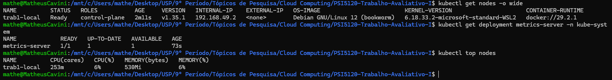

**EL2 — HPA criado, sem carga**
```bash
kubectl get hpa -n trab1-local
```
O que foi registrado: `TARGETS` próximo de `1%/50%`; `REPLICAS` igual a 1.

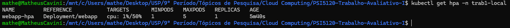

**EL3 — Sequência completa de escalonamento (scale-up e scale-down)**

Objetivo: registrar o ciclo inteiro de reação do HPA — desde o estado ocioso, passando pelo aumento de utilização de CPU e pelo escalonamento para cima, até a interrupção da carga e o retorno gradual ao número mínimo de réplicas.

| Etapa | Horário | CPU | Réplicas | Min | Max | Observação |
|---|---:|---:|---:|---:|---:|---|
| **Antes** | 18:38:58 | 1% | 1 | 1 | 5 | Estado inicial |
| **Início** | 18:39:59 | 1% | 1 | 1 | 5 | Carga iniciada |
| **Durante** | 18:40:50 | 204% | 1 | 1 | 5 | CPU elevada |
| **Durante** | 18:41:10 | 204% | 4 | 1 | 5 | Scale-up iniciado |
| **Durante** | 18:41:20 | 204% | 5 | 1 | 5 | Atingiu máximo |
| **Durante** | 18:41:51 | 116% | 5 | 1 | 5 | Carga ainda alta |
| **Durante** | 18:46:19 | 68% | 5 | 1 | 5 | Carga reduzindo |
| **Durante** | 18:46:29 | 68% | 5 | 1 | 5 | Estável em 5 |
| **Durante** | 18:47:08 | 50% | 5 | 1 | 5 | CPU no alvo |
| **Após cessar carga** | 18:47:39 | 50% | 5 | 1 | 5 | Carga cessada |
| **Após cessar carga** | 18:48:09 | 39% | 5 | 1 | 5 | CPU reduzindo |
| **Após cessar carga** | 18:49:10 | 1% | 5 | 1 | 5 | CPU praticamente ociosa |
| **Após cessar carga** | 18:52:24 | 1% | 5 | 1 | 5 | Mantém 5 temporariamente |
| **Após cessar carga** | 18:52:54 | 1% | 4 | 1 | 5 | Scale-down iniciado |
| **Após cessar carga** | 18:54:16 | 1% | 1 | 1 | 5 | Retornou ao mínimo |

*(O horário da linha "Carga reduzindo" foi corrigido de um erro de fuso horário não determinístico no registro original, de 21:46:19 para 18:46:19 — consistente com a sequência cronológica das leituras vizinhas.)*

**Tempos de reação calculados a partir da tabela:**
- Scale-out (início da carga → primeiro incremento de réplicas): 18:39:59 → 18:41:10 = **1min11s**
- Tempo até atingir o máximo de réplicas: 18:39:59 → 18:41:20 = **1min21s**
- Scale-down (carga cessada → primeira redução de réplicas): 18:47:39 → 18:52:54 = **5min15s**
- Tempo até retornar ao mínimo: 18:47:39 → 18:54:16 = **6min37s**

O intervalo de aproximadamente 5 minutos entre a carga cessar e o início do scale-down é consistente com a janela de estabilização padrão do HPA (`--horizontal-pod-autoscaler-downscale-stabilization`), que existe justamente para evitar reduções de réplicas causadas por quedas de tráfego momentâneas.

**Sequência de registros** (uma captura por linha da tabela acima, na ordem):

*Antes*

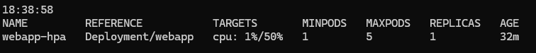

*Início*

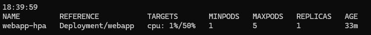

*Durante*

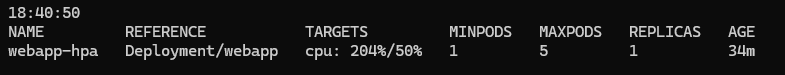

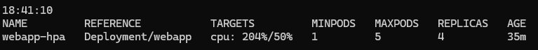

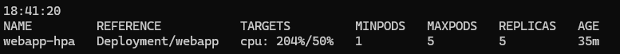

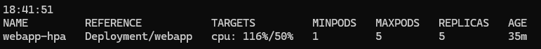

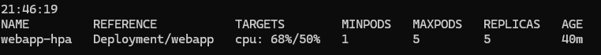

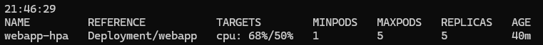

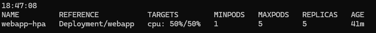


*Após cessar carga*

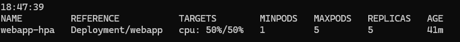

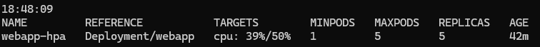

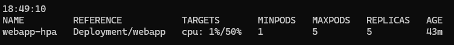

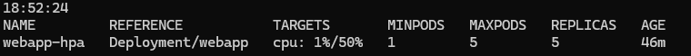

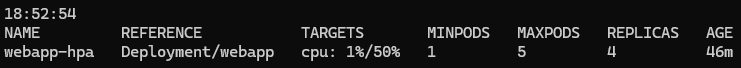

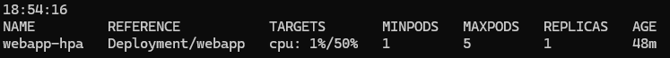


**EL4 — Acesso funcional via navegador**
```bash
kubectl port-forward -n trab1-local service/webapp-svc 8080:80
```
Com o túnel aberto, o endereço `http://localhost:8080` foi acessado diretamente do navegador. Esta evidência é complementar às anteriores: os comandos `kubectl get` confirmam o estado dos objetos do Kubernetes, mas não garantem, por si só, que a aplicação responde corretamente por HTTP — o mesmo raciocínio já discutido na Aula 5, em que um Pod `Running` não é prova de que a aplicação está de fato funcional. O que foi registrado: a página personalizada carregando corretamente no navegador, com o contador de acessos incrementando a cada novo carregamento.

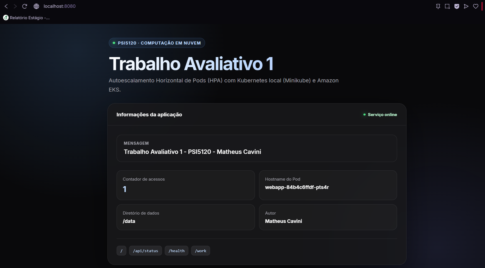

### 3.8 Conclusão da Parte A

A implantação local permitiu validar, de ponta a ponta, o ciclo completo do HPA: o Metrics Server foi habilitado com um único comando de addon, a imagem foi disponibilizada ao cluster sem depender de nenhum registro externo, e tanto o escalonamento para cima quanto a redução de réplicas foram confirmados com tempos concretos — reação de escalonamento em pouco mais de 1 minuto após o início da carga, e retorno ao mínimo cerca de 6min37s após a carga cessar, coerente com a janela de estabilização padrão do HPA. A aplicação também se manteve funcional durante todo o ciclo, confirmado pelo acesso via navegador (EL4). Essa etapa serviu como base de comparação para a implantação em nuvem, descrita a seguir, na qual os mesmos manifestos foram reaproveitados sob uma infraestrutura substancialmente diferente.

---

## 4. Parte B — Implantação em Nuvem (Amazon EKS)

### 4.1 Preparação do ambiente do zero

**Roles IAM.** Foram criadas duas roles no IAM Console:

- `psi5120-trab1-eks-cluster-role` — trusted entity `AWS service`, use case `EKS – Cluster`, política `AmazonEKSClusterPolicy`.
- `psi5120-trab1-eks-node-role` — trusted entity `AWS service`, use case `EC2`, políticas `AmazonEKSWorkerNodePolicy`, `AmazonEC2ContainerRegistryPullOnly` e `AmazonEKS_CNI_Policy`.

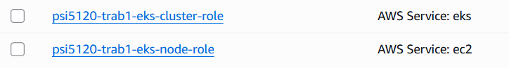

**Rede via CloudFormation.** Foi criada uma VPC dedicada com o template público oficial do Amazon EKS (três subnets públicas, sem NAT Gateway):

```bash
export REGIAO=us-east-1
export VPC_STACK=psi5120-trab1-vpc
export CLUSTER=psi5120-trab1-eks
export NODEGROUP=psi5120-trab1-ng
export NAMESPACE=trab1-eks
```

No Console: *CloudFormation → Stacks → Create stack → With new resources*, template a partir da URL `https://s3.us-west-2.amazonaws.com/amazon-eks/cloudformation/2020-10-29/amazon-eks-vpc-sample.yaml`, nome da stack `psi5120-trab1-vpc`, parâmetros padrão. Foi aguardado o `CREATE_COMPLETE`, e os outputs foram anotados para uso na criação do cluster:

| Output | Valor |
|---|---|
| `VpcId` | `vpc-0e069f61100060cd7` |
| `SubnetIds` | `subnet-034ed013108c55796, subnet-08482eb023d852899, subnet-02e6eca5f54884688` |
| `SecurityGroups` | `sg-0ac4473d3eb9f1e77` (security group para comunicação entre o plano de controle e os nodes) |

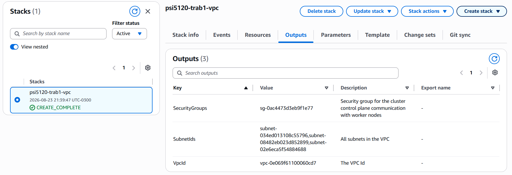

**Cluster EKS.** No Console: *EKS → Clusters → Create cluster*, configuração customizada (sem Auto Mode):

| Campo | Valor |
|---|---|
| Nome | `psi5120-trab1-eks` |
| Cluster IAM role | `psi5120-trab1-eks-cluster-role` |
| Versão Kubernetes | mais recente em standard support |
| Cluster authentication mode | EKS API |
| Bootstrap cluster administrator access | habilitado |
| VPC / Subnets / Security group | outputs da stack `psi5120-trab1-vpc`, acima |
| Endpoint | público, `0.0.0.0/0` (apenas durante a prática) |
| Add-ons | mantidos apenas VPC CNI, CoreDNS, kube-proxy (Metrics Server instalado à parte, seção 4.2) |

Foi aguardado o cluster atingir o estado `Active`.

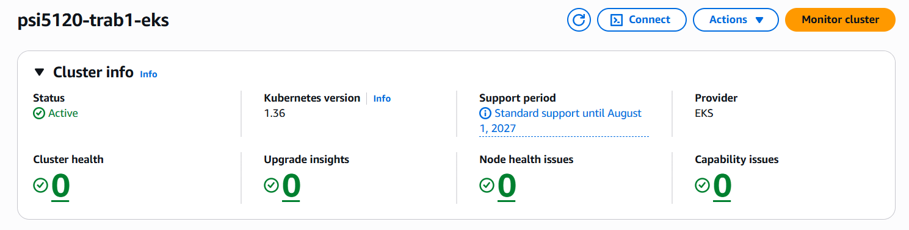

**Managed node group.** Em *Compute → Add node group*:

| Campo | Valor |
|---|---|
| Nome | `psi5120-trab1-ng` |
| Node IAM role | `psi5120-trab1-eks-node-role` |
| Instance type | `t3.medium` |
| Capacity type | On-Demand |
| Desired / min / max | 1 / 1 / 1 |
| Disco | 20 GiB |
| Acesso SSH | desabilitado |


**Conectando via CloudShell:**

```bash
aws eks update-kubeconfig --region "$REGIAO" --name "$CLUSTER"
kubectl get nodes -o wide
```

### 4.2 Metrics Server

Diferente do Minikube, um cluster EKS criado pelo Console não inclui o Metrics Server por padrão. Foi seguido o caminho recomendado atualmente, que é instalá-lo como add-on gerenciado pela própria EKS (catálogo de community add-ons):

- No Console do cluster, aba **Add-ons → Get more add-ons → Community add-ons → Metrics Server**, foi aceita a versão sugerida e o add-on foi criado.


A validação seguiu o mesmo padrão da Parte A:

```bash
kubectl get deployment metrics-server -n kube-system
kubectl top nodes
```

### 4.3 Registro da imagem (Amazon ECR)

No EKS não é possível carregar uma imagem local diretamente no cluster como no Minikube: a imagem precisa estar em um registro alcançável pelos nodes. Foi utilizado o Amazon ECR, na mesma conta e região do cluster. A imagem foi então buildada localmente a partir do `app.py` e salva no ECR.

```bash
export ACCOUNT_ID=$(aws sts get-caller-identity --query Account --output text)
export REPO_URI="${ACCOUNT_ID}.dkr.ecr.${REGIAO}.amazonaws.com/psi5120-trab1-app"

aws ecr create-repository --repository-name psi5120-trab1-app --region "$REGIAO"

# build e push realizados direto no CloudShell, que já tem Docker
# e as credenciais da sessão configuradas
aws ecr get-login-password --region "$REGIAO" \
  | docker login --username AWS --password-stdin "${ACCOUNT_ID}.dkr.ecr.${REGIAO}.amazonaws.com"

docker build -t psi5120-trab1-app:v1 .
docker tag psi5120-trab1-app:v1 "${REPO_URI}:v1"
docker push "${REPO_URI}:v1"
```

### 4.4 Manifestos

Os mesmos objetos descritos na Seção 3.5 (Namespace, Deployment, Service e HorizontalPodAutoscaler) foram reaproveitados aqui, com dois ajustes: namespace `trab1-eks` e `image` apontando para o repositório ECR, em vez da imagem carregada localmente.

```bash
kubectl create namespace trab1-eks
```

**`manifests/01-webapp-eks.yaml`** — idêntico ao da Parte A, exceto:

```yaml
      containers:
        - name: webapp
          image: 504895205502.dkr.ecr.us-east-1.amazonaws.com/psi5120-trab1-app
          imagePullPolicy: IfNotPresent
```

```bash
kubectl apply -n trab1-eks -f manifests/00-namespace-eks.yaml
kubectl apply -n trab1-eks -f manifests/01-webapp-eks.yaml
kubectl apply -n trab1-eks -f manifests/02-hpa-eks.yaml
kubectl get hpa -n trab1-eks
```

### 4.5 Geração de carga

Para evitar custo com um Load Balancer criado apenas para o teste, a carga foi gerada internamente ao cluster, do mesmo modo que na Parte A, com o mesmo padrão de observação cronometrada:

```bash
kubectl run load-generator -n trab1-eks --image=busybox --restart=Never -it --rm -- \
  /bin/sh -c "while sleep 0.01; do wget -q -O- http://webapp-svc/work; done"
```

```bash
while true; do date +%T; kubectl get hpa webapp-hpa -n trab1-eks; sleep 10; done | tee hpa-log-eks.txt
```

### 4.6 Evidências coletadas — implantação em nuvem

Assim como na Parte A, as evidências a seguir documentam a prontidão do ambiente, o estado do HPA antes da carga, o ciclo completo de escalonamento e os limites de capacidade do node group.

_(EE = Evidência do EKS)_

**EE1 — Cluster, node group e Metrics Server operacionais**
```bash
kubectl get nodes -o wide
kubectl get deployment metrics-server -n kube-system
kubectl top nodes
```
O que deve ser registrado: status `Ready` do node; `READY 1/1` do metrics-server; tipo de instância visível na saída.

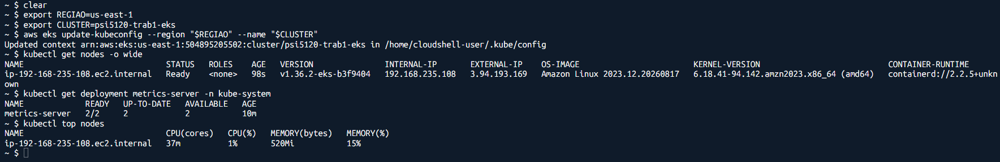

**EE2 — HPA criado, sem carga**
```bash
kubectl get hpa -n trab1-eks
```
O que deve ser registrado: `TARGETS` próximo de `0%/50%`; `REPLICAS` igual a 1.

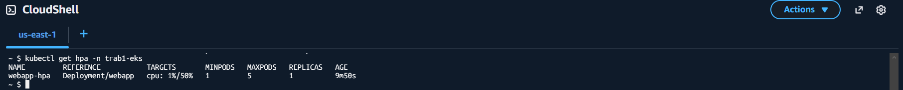

**EE3 — Sequência completa de escalonamento (scale-up e scale-down)**

Objetivo: mesmo propósito da evidência EL3, aplicado ao cluster em nuvem, para permitir a comparação direta de tempos de reação entre os dois ambientes.

| Fase | Horário | CPU | Réplicas |
|---|---:|---:|---:|
| **Antes** | 01:25:44 | 1% | 1 |
| **Início** | 01:26:48 | 1% | 1 |
| **Durante** | 01:27:09 | 288% | 1 |
| **Durante** | 01:27:20 | 299% | 4 |
| **Durante** | 01:27:41 | 85% | 5 |
| **Durante** | 01:27:51 | 63% | 5 |
| **Durante** | 01:28:13 | 61% | 5 |
| **Durante** | 01:28:44 | 49% | 5 |
| **Durante** | 01:31:28 | 52% | 5 |
| **Descarga** | 01:35:10 | 1% | 5 |
| **Descarga** | 01:36:41 | 1% | 5 |
| **Descarga** | 01:39:11 | 1% | 1 |

(Política do HPA idêntica à da Parte A: mínimo 1, máximo 5 réplicas, alvo de 50% de CPU.)

**Tempos de reação calculados a partir da tabela:**
- Scale-out (início da carga → primeiro incremento de réplicas): 01:26:48 → 01:27:20 = **32s**
- Tempo até atingir o máximo de réplicas: 01:26:48 → 01:27:41 = **53s**
- Scale-down: o intervalo entre leituras cresceu na fase final da coleta (de ~10s para alguns minutos), então o horário exato em que a carga foi interrompida não ficou registrado com a mesma precisão da Parte A. A última leitura confirmada com a carga ainda ativa foi às 01:31:28 (52% de CPU, 5 réplicas); a redução para 1 réplica já estava consolidada às 01:39:11, sem o degrau intermediário de 4 réplicas ter sido capturado — provavelmente por ter ocorrido no intervalo sem leitura, e não por ausência real desse degrau (o mesmo padrão de redução em dois passos foi observado na Parte A).

**Sequência fotográfica** (uma captura por linha da tabela acima, na ordem):

*Antes*

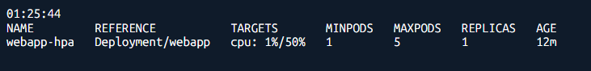

*Início*

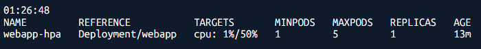

*Durante*

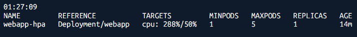

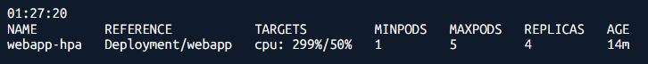

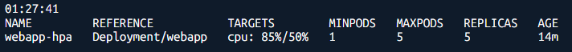

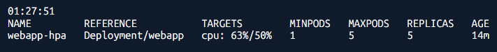

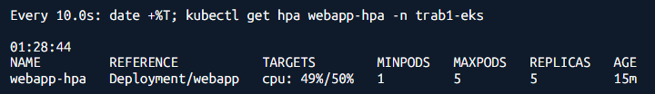

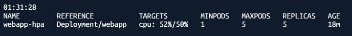

*Descarga*


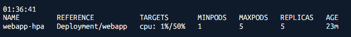

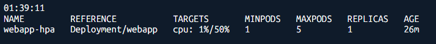


**Pods sob carga**

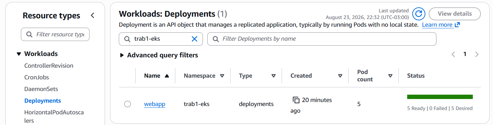

**Pods sem carga**

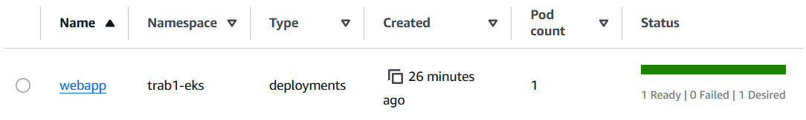


### 4.7 Limpeza realizada ao final

```bash
kubectl delete namespace trab1-eks
eksctl delete nodegroup --cluster "$CLUSTER" --name "$NODEGROUP" --region "$REGIAO" 2>/dev/null \
  || echo "node group removido pelo Console, em Compute"
# cluster removido pelo Console (EKS -> Clusters -> Delete)
# por fim, a stack da VPC foi removida
aws cloudformation delete-stack --region "$REGIAO" --stack-name "$VPC_STACK"
aws ecr delete-repository --region "$REGIAO" --repository-name psi5120-trab1-app --force
```

### 4.8 Conclusão da Parte B

A implantação em nuvem reaproveitou integralmente a definição da aplicação usada na Parte A, mas exigiu uma sequência de provisionamento bem mais longa antes de chegar ao mesmo ponto de partida: papéis IAM, rede dedicada, cluster gerenciado, node group e um registro de imagens próprio. Em contrapartida, o plano de controle passou a ser gerenciado pela AWS, sem qualquer operação adicional, e a capacidade do node group tornou-se uma variável explícita a observar — algo que não existe na implantação local, onde a máquina que executa o Minikube concentra tanto o plano de controle quanto a capacidade de trabalho.

No ciclo de carga em si, o comportamento funcional foi equivalente ao observado localmente — mesma política de HPA, mesmo padrão de escalonamento até o máximo de réplicas —, mas com tempos de reação numericamente menores: escalonamento em 32s (contra 1min11s local) e máximo atingido em 53s (contra 1min21s local). Essa diferença deve ser lida com cautela: os dois ciclos foram medidos uma única vez cada, com granularidade de leitura diferente entre os ambientes (mais fina na Parte A, com lacunas maiores no fim da coleta da Parte B), então não é possível atribuir com confiança a diferença observada apenas à infraestrutura, sem descartar variação de amostragem. Ainda assim, o resultado qualitativo mais importante se confirma nos dois ambientes: a lógica de reação do HPA é a mesma, e as diferenças relevantes concentram-se na infraestrutura ao redor do cluster, não no comportamento da API do Kubernetes em si.

---

## 5. Metodologia consolidada dos testes de carga

O mesmo método de geração de carga foi utilizado nos dois ambientes — de propósito, para que as diferenças observadas pudessem ser atribuídas ao ambiente de execução, e não ao teste em si.

| Parâmetro | Valor utilizado |
|---|---|
| Ferramenta de carga | Pod `busybox` em loop de `wget` (`kubectl run --rm`) |
| Intervalo entre requisições | `sleep 0.01` (~100 requisições/segundo) |
| Endpoint-alvo | `/work` do Service `webapp-svc` (ClusterIP), porta 80 |
| Intensidade de `/work` | `WORK_ITERATIONS=2000000` (~130-140 ms de CPU por chamada) |
| Métrica monitorada pelo HPA | Utilização média de CPU (`Resource: cpu`, `Utilization`) |
| Alvo de utilização | 50% |
| minReplicas / maxReplicas | 1 / 5 |
| Critério de encerramento da carga | Interrupção manual (Ctrl+C) após observada a estabilização de `REPLICAS` |
| Frequência de amostragem do HPA | leitura a cada 10s, registrada com horário (`date +%T`) via `tee` em arquivo de log |

A figura abaixo consolida visualmente os dois ciclos completos (utilização de CPU e número de réplicas ao longo do tempo, a partir do início da carga em cada ambiente), construída a partir das tabelas das evidências EL3 e EE3:

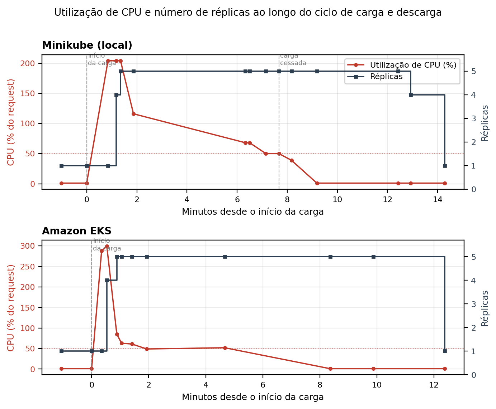

Em ambos os ambientes, o ciclo completo (carga e descarga) foi conduzido uma única vez. Isso é registrado como limitação na Seção 6: os tempos de reação reportados são medições pontuais, não médias de múltiplas repetições.

---

## 6. Limitações identificadas neste roteiro

- O teste de carga usa um único Pod gerador; não representa um padrão de tráfego realista, apenas um estímulo suficiente para acionar o HPA de forma controlada e reproduzível.
- O endpoint `/work` roda em `ThreadingHTTPServer`, sujeito ao GIL do Python: cada Pod não paraleliza a carga em múltiplos núcleos, mas isso não compromete o teste, já que o HPA reage à utilização de CPU por Pod individualmente, não à capacidade de concorrência interna de cada processo.
- Em ambos os ambientes, o ciclo de carga e descarga foi conduzido uma única vez; os tempos de reação reportados (Seções 3.7 e 4.6) são medições pontuais, não médias estatísticas de múltiplas repetições.
- A granularidade de amostragem das leituras do HPA não foi idêntica entre os dois ambientes na fase final do ciclo: a Parte A manteve leituras a cada ~10-30s até o fim, enquanto a Parte B teve lacunas maiores (de alguns minutos) na fase de descarga, o que limita a precisão da comparação de tempo de scale-down entre os ambientes.
- No EKS, o node group com um único `t3.medium` comportou as cinco réplicas do HPA sem atingir seu limite de capacidade nesta execução; o comportamento em caso de capacidade insuficiente não foi observado empiricamente.
- Nenhuma das duas implantações usa Cluster Autoscaler: o HPA demonstrado neste trabalho escala apenas Pods, não nodes, o que está fora do escopo definido para o trabalho.

---

## 7. Conclusão geral

Este trabalho implantou a mesma aplicação, com os mesmos manifestos de Deployment, Service e HorizontalPodAutoscaler, em dois ambientes Kubernetes de naturezas distintas. A implantação local, com Minikube, permitiu validar de forma rápida e sem custo o ciclo completo do HPA — escalonamento para cima em resposta ao aumento de CPU, e redução gradual após a carga cessar, com tempos de reação medidos em cerca de 1min11s (scale-out) e 6min37s (retorno ao mínimo, incluindo a janela de estabilização). A implantação em nuvem, na Amazon EKS, reproduziu esse mesmo comportamento sobre uma infraestrutura gerenciada, com tempos de reação numericamente menores no scale-out (32s), mas medidos em uma única execução cada, o que não permite por si só generalizar a diferença como uma propriedade do ambiente.

O resultado mais robusto, presente nos dois ambientes, é qualitativo: a lógica de autoescalamento é uma propriedade da API do Kubernetes, e não do ambiente que a executa, enquanto as diferenças relevantes entre os dois ambientes concentraram-se na infraestrutura subjacente: número de etapas de provisionamento, disponibilidade do Metrics Server, origem da imagem de container e o papel explícito da capacidade do node group, que na implantação em nuvem se torna uma variável a gerenciar separadamente da aplicação.

As evidências reunidas neste roteiro, incluindo as tabelas e sequências fotográficas completas dos ciclos de carga e descarga em ambos os ambientes, servem de base direta para a análise comparativa desenvolvida no artigo técnico.

---

## 8. Referências técnicas

- Kubernetes Documentation. *HorizontalPodAutoscaler Walkthrough*. https://kubernetes.io/docs/tasks/run-application/horizontal-pod-autoscale-walkthrough/
- Amazon EKS Documentation. *Scale pod deployments with Horizontal Pod Autoscaler*. https://docs.aws.amazon.com/eks/latest/userguide/horizontal-pod-autoscaler.html
- Amazon EKS Documentation. *View resource usage with the Kubernetes Metrics Server*. https://docs.aws.amazon.com/eks/latest/userguide/metrics-server.html
- Kubernetes SIGs. *metrics-server*. https://github.com/kubernetes-sigs/metrics-server
- Minikube Documentation. *Addons*. https://minikube.sigs.k8s.io/docs/handbook/addons/
- Amazon EKS Documentation. *Getting started with Amazon EKS — AWS Management Console and CLI*. https://docs.aws.amazon.com/eks/latest/userguide/getting-started.html